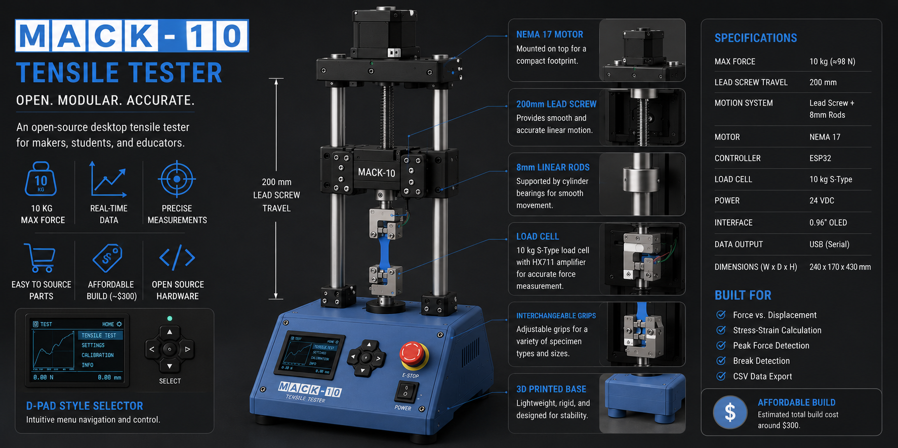
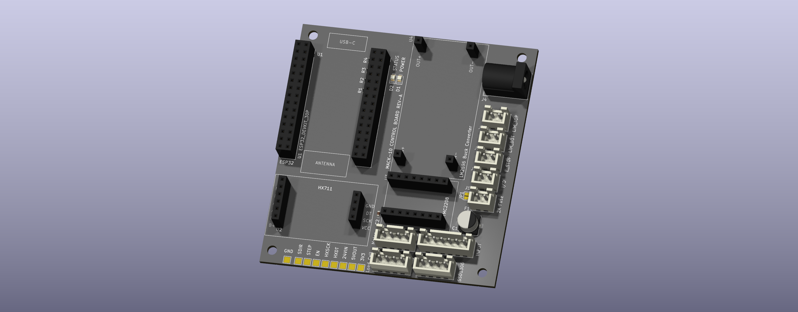
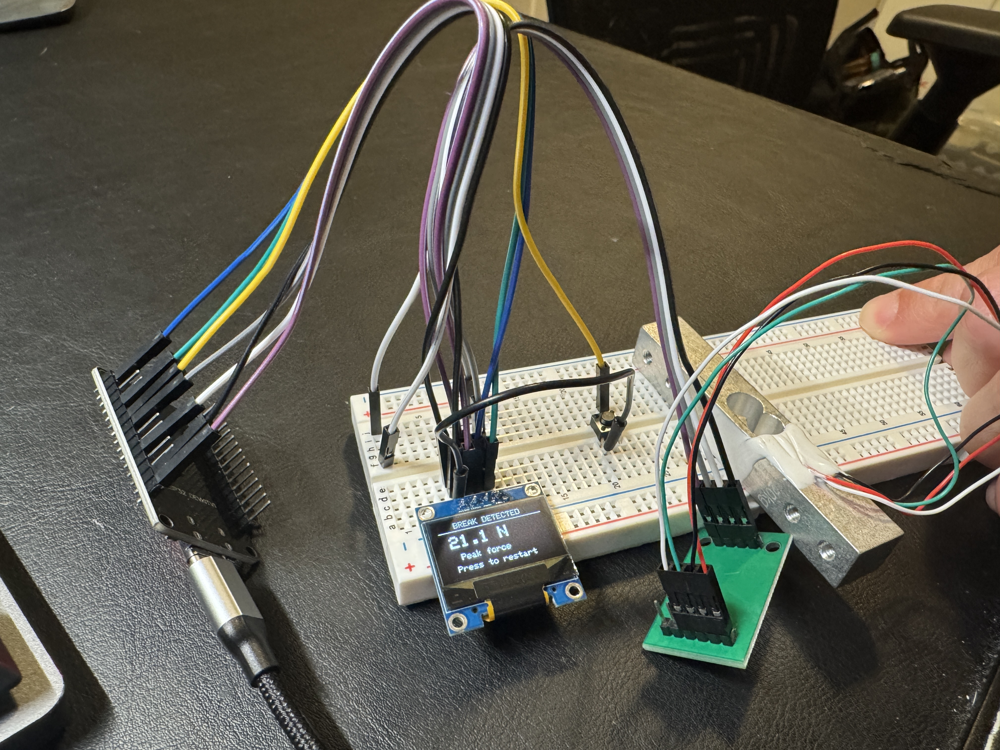

# MACK-10 Tensile Tester

> An open-source desktop tensile tester for material characterization, designed to make mechanical testing affordable, accessible, and educational.

<p align="center">
  
</p>


---

# Project Overview

MACK-10 is an open-source desktop tensile testing machine designed to evaluate the mechanical properties of small material specimens including:

- 3D printed plastics
- Engineering polymers
- Composites
- Thin metals
- Educational material samples

The project combines embedded systems, mechanical design, motion control, and materials engineering into a low-cost testing platform capable of measuring force and displacement while generating professional-quality stress-strain data.

The long-term goal is to create an affordable tensile tester that can be built by hobbyists, makers, students, educators, and small labs for a fraction of the cost of commercial testing equipment.

---

# Why MACK-10?

Commercial tensile testers often cost $5,000 – $50,000+, making them inaccessible to many students, hobbyists, makerspaces, and small workshops.

MACK-10 explores how modern maker hardware—including microcontrollers, affordable sensors, 3D printing, custom PCBs, and open-source software—can be combined to build a capable educational testing machine at a fraction of the cost.

---

# Current Status

🚧 **Prototype Development (Revision 0.1)**

## Electronics

<p align="center">
  
</p>

### Controller Hardware

- [x] Custom KiCad PCB
- [x] ESP32 Controller
- [x] HX711 Load Cell Interface
- [x] TMC2208 Stepper Driver
- [x] LM2596 Power Module
- [x] OLED Display
- [x] Emergency Stop Circuit
- [x] Dual Limit Switch Inputs
- [x] Modular JST Wiring

### Firmware

- [x] PlatformIO Project
- [x] OLED User Interface
- [x] Automatic Taring
- [x] Peak Force Tracking
- [x] Break Detection Simulation
- [x] Live Serial Plotting

## Mechanical

- [ ] Linear Motion Assembly
- [ ] NEMA 17 Drive System
- [ ] Lead Screw Integration
- [ ] Load Cell Mount
- [ ] Specimen Grips
- [ ] Structural Frame
- [ ] Electronics Enclosure

## Software

- [ ] Load Cell Calibration
- [ ] Closed-loop Motor Control
- [ ] Crosshead Speed Control
- [ ] Position Tracking
- [ ] Force vs. Displacement Logging
- [ ] Stress-Strain Calculations
- [ ] CSV Export
- [ ] SD Card Support
- [ ] Material Database

---

# Planned Features

- Live force measurement
- Real-time graphing
- Automatic specimen taring
- Adjustable crosshead speed
- Peak force detection
- Break detection
- Force vs. displacement plotting
- Stress-strain generation
- Material property calculations
- CSV export
- Calibration wizard
- OLED graphical interface
- Emergency stop
- Limit switch homing
- Modular firmware architecture

---

# Target Specifications

| Specification  | Target               |
| -------------- | -------------------- |
| Maximum Force  | 10 kg (≈98 N)        |
| Load Cell      | 10 kg S-Type         |
| Controller     | ESP32                |
| Motion         | NEMA 17 + Lead Screw |
| User Interface | 128×64 OLED          |
| Power          | 24 VDC               |
| PCB            | Custom KiCad Design  |
| Firmware       | PlatformIO           |

---

# Repository Structure

```text
firmware/      ESP32 firmware
pcb/           KiCad project files
cad/           Mechanical CAD models
docs/          Documentation
images/        Project photos and diagrams
```

Additional documentation (assembly guide, wiring diagrams, calibration procedures, manufacturing files, etc.) will be added as development progresses.

---

# Bill of Materials (BOM)

## Estimated Build Cost

| Category            | Estimated Cost |
| ------------------- | -------------: |
| Electronics         |         $85–95 |
| Mechanical Hardware |       $170–195 |
| 24 V Power Supply   |         $15–35 |
| **Estimated Total** |   **$270–325** |

---

## Electronics BOM

|   Qty | Component                    | Approx. Cost (Each) | Line Total |
| ----: | ---------------------------- | ------------------: | ---------: |
|     1 | ESP32 DevKit V1              |                  $8 |         $8 |
|     1 | Custom Controller PCB        |                $2–6 |       $2–6 |
|     1 | HX711 Load Cell Amplifier    |                  $3 |         $3 |
|     1 | TMC2208 Stepper Driver       |                  $5 |         $5 |
|     1 | LM2596 Buck Converter        |                  $2 |         $2 |
|     1 | 10 kg S-Type Load Cell       |                 $25 |        $25 |
|     1 | 0.96" SSD1306 OLED Display   |                  $5 |         $5 |
|     1 | PCB Fuse Holder              |                  $1 |         $1 |
|     1 | 2–2.5 A Fuse                 |               $0.50 |      $0.50 |
|     1 | Power Switch                 |                  $3 |         $3 |
|     1 | Emergency Stop Switch        |                 $12 |        $12 |
|     2 | Limit Switches               |                  $2 |         $4 |
| 1 Set | JST-XH Connectors & Crimps   |                  $4 |         $4 |
| 1 Set | Female Header Sockets        |                  $2 |         $2 |
|     — | LEDs, Resistors & Capacitors |                 ~$2 |        ~$2 |
|     — | Wire, Heat Shrink & Misc.    |                 ~$5 |        ~$5 |

**Estimated Electronics Cost:** **$85–95**

---

## Mechanical BOM

| Qty | Component              | Approx. Cost (Each) | Line Total |
| --: | ---------------------- | ------------------: | ---------: |
|   1 | NEMA 17 Stepper Motor  |                 $18 |        $18 |
|   1 | Lead Screw Assembly    |                 $25 |        $25 |
|   1 | Flexible Shaft Coupler |                  $6 |         $6 |
|   2 | Linear Rails           |                 $25 |        $50 |
| 2–4 | Linear Bearing Blocks  |        Included–$20 |      $0–20 |
|   1 | Structural Hardware    |                 $20 |        $20 |
|   1 | Grip Hardware          |                 $20 |        $20 |
|   1 | Fastener Kit           |                 $10 |        $10 |
|   1 | Heat-Set Inserts       |                  $5 |         $5 |
|   — | Filament (Consumed)    |                ~$20 |       ~$20 |

### 3D Printed Parts _(Files TBD)_

- Base
- Moving Crosshead
- Motor Mount
- Load Cell Mount
- Electronics Enclosure
- OLED Bezel
- Specimen Grip Bodies
- Cable Management Components

**Estimated Mechanical Cost:** **$170–195**

---

<p align="center">
  
</p>

---

# Project Roadmap

## Revision 1

- Complete first working prototype
- Functional motion control
- Load cell calibration
- Initial tensile testing

## Revision 2

- PCB optimization
- Improved enclosure
- Better cable management
- Higher testing accuracy

## Revision 3

- Automated calibration
- Material database
- Desktop application
- Improved manufacturability

---

# Project Goals

- Build an affordable tensile tester for hobbyists, students, and makers.
- Learn embedded systems, motion control, PCB design, and machine design.
- Generate repeatable force-displacement and stress-strain data.
- Create a modular open-source hardware platform that others can build and improve.

---

# Disclaimer

This project is intended for educational and hobby use only and is **not** intended to replace calibrated or certified laboratory testing equipment.

Measurements obtained from this device should not be used for engineering certification, regulatory compliance, or safety-critical design decisions.

---

**Project Status:** Active Development 🚧
