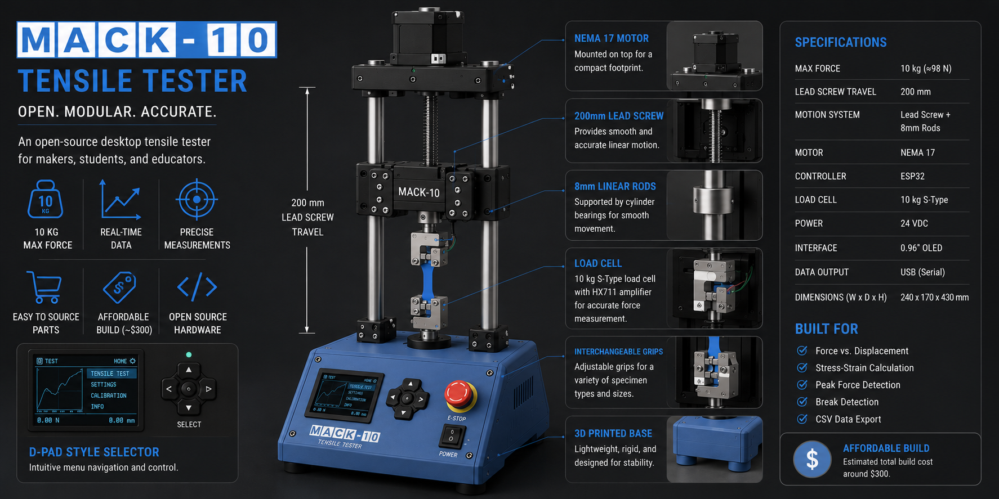
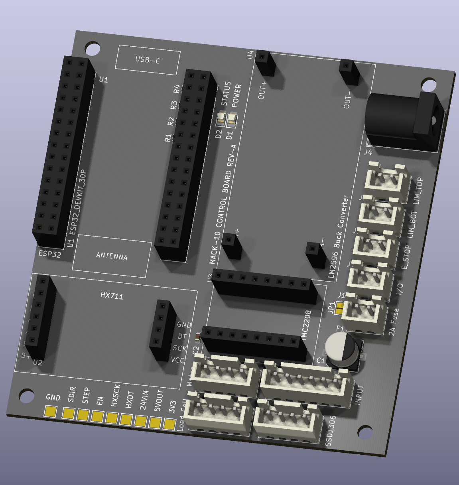
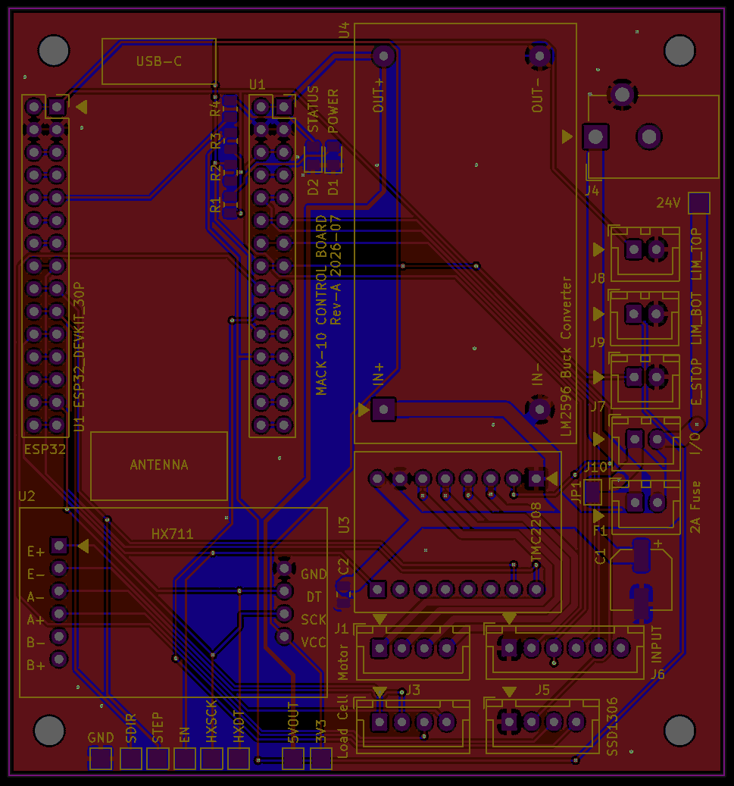
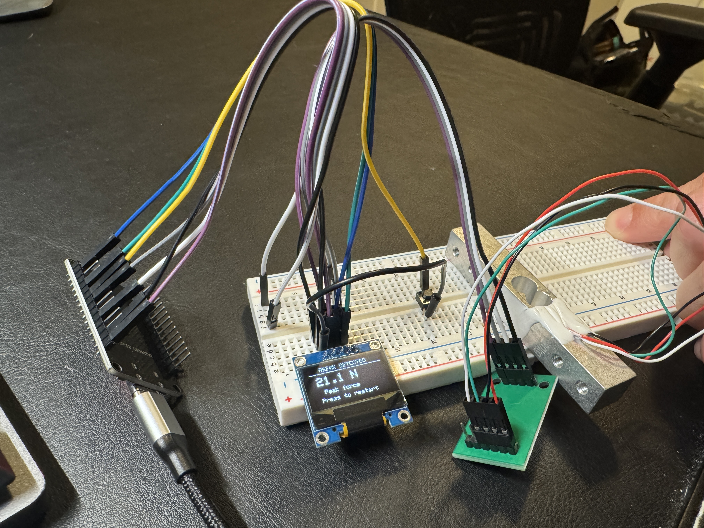

# MACK-10 Tensile Tester

> An open-source desktop tensile tester for affordable material characterization and education.

<p align="center">
  
</p>


---

# Overview

MACK-10 is an open-source desktop tensile tester designed to measure the force and displacement of small material specimens.

The project combines an ESP32-based controller, load cell, stepper-driven linear stage, custom PCB, and 3D-printed components to create a low-cost alternative to commercial material testing equipment.

The target capacity is **10 kg (~98 N)**, making MACK-10 suitable for testing:

- 3D-printed plastics
- Engineering polymers
- Composites
- Thin metals
- Educational material samples

---

# Current Status

🚧 **Prototype Development — Revision 1**

<p align="center">
  
</p>

## Electronics

<p align="center">
  
  
</p>

- [x] Custom KiCad controller PCB
- [x] ESP32 controller
- [x] HX711 load cell interface
- [x] TMC2208 stepper driver
- [x] LM2596 power regulation
- [x] OLED interface
- [x] E-stop input
- [x] Dual limit switch inputs
- [x] PlatformIO firmware
- [x] Automatic taring
- [x] Peak force tracking
- [x] Break detection
- [x] Live serial plotting

## Mechanical

- [x] 200 mm T6×1 linear motion stage
- [x] NEMA 11 stepper drive
- [ ] Structural frame
- [ ] Load cell mount
- [ ] Specimen grips
- [ ] Electronics enclosure

## In Development

- [ ] Load cell calibration
- [ ] Crosshead speed control
- [ ] Position tracking
- [ ] Force-displacement logging
- [ ] Stress-strain calculations
- [ ] CSV export

---

# Target Specifications

| Specification  | Target                    |
| -------------- | ------------------------- |
| Maximum Force  | 10 kg (~98 N)             |
| Load Cell      | 10 kg S-Type              |
| Controller     | ESP32                     |
| Motion         | NEMA 11 + T6×1 Lead Screw |
| Travel         | 200 mm                    |
| User Interface | 128×64 OLED               |
| PCB            | Custom KiCad Design       |
| Firmware       | PlatformIO                |

---

# Bill of Materials

## Electronics

|   Qty | Component                     | Approx. Cost | Line Total |
| ----: | ----------------------------- | -----------: | ---------: |
|     1 | ESP32 DevKit V1               |        $8.00 |      $8.00 |
|     1 | Custom MACK-10 Controller PCB |        $1.08 |      $1.08 |
|     1 | HX711 Load Cell Amplifier     |        $3.00 |      $3.00 |
|     1 | TMC2208 Stepper Driver        |        $5.00 |      $5.00 |
|     1 | LM2596 Buck Converter         |        $2.00 |      $2.00 |
|     1 | 10 kg S-Type Load Cell        |       $25.00 |     $25.00 |
|     1 | SSD1306 128×64 OLED           |        $5.00 |      $5.00 |
|     1 | PCB Fuse Holder               |        $1.00 |      $1.00 |
|     1 | 2–2.5 A Fuse                  |        $0.50 |      $0.50 |
|     1 | Power Switch                  |        $3.00 |      $3.00 |
|     1 | Emergency Stop Switch         |       $12.00 |     $12.00 |
|     2 | Limit Switches                |        $2.00 |      $4.00 |
| 1 Set | JST-XH Connectors & Crimps    |        $4.00 |      $4.00 |
| 1 Set | Female Header Sockets         |        $2.00 |      $2.00 |
|     — | LEDs, Resistors & Capacitors  |       ~$2.00 |     ~$2.00 |
|     — | Wire, Heat Shrink & Misc.     |       ~$5.00 |     ~$5.00 |

**Estimated Electronics Cost: ~$83**

## Mechanical

| Qty | Component                        | Approx. Cost | Line Total |
| --: | -------------------------------- | -----------: | ---------: |
|   1 | T6×1 Linear Motion Stage, 200 mm |       $31.99 |     $31.99 |
|   1 | NEMA 11 Stepper Motor            |     Included |   Included |
|   1 | T6×1 Lead Screw                  |     Included |   Included |
|   1 | Linear Guide & Carriage          |     Included |   Included |
|   1 | Structural Frame Hardware        |      ~$20.00 |    ~$20.00 |
|   1 | Grip Hardware                    |      ~$20.00 |    ~$20.00 |
|   1 | M3 Fastener Kit                  |      ~$10.00 |    ~$10.00 |
|   1 | M3 Heat-Set Inserts              |       ~$5.00 |     ~$5.00 |
|   — | Filament                         |      ~$20.00 |    ~$20.00 |

**Estimated Mechanical Cost: ~$107**

**Current Estimated Build Cost: ~$190 + power supply and miscellaneous hardware**

---

<p align="center">
  
</p>

---

# Repository Structure

```text
firmware/    ESP32 firmware
pcb/         KiCad project files
cad/         Mechanical CAD models
docs/        Documentation
images/      Project photos and diagrams
```

---

# Roadmap

### Revision 1

Complete the mechanical assembly, calibrate the load cell, and perform initial tensile tests.

### Revision 2

Optimize the PCB, wiring, enclosure, motion control, and data acquisition.

### Revision 3

Add automated testing, material property calculations, and desktop software.

---

# Disclaimer

MACK-10 is intended for educational and hobby use and is not a replacement for calibrated or certified laboratory testing equipment.

Measurements should not be used for engineering certification, regulatory compliance, or safety-critical design decisions.

---

**Project Status:** Active Development 🚧
